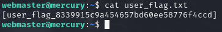

# How to Hack "The Planets: Mercury" From VulnHub

In [Vulnhub](https://www.vulnhub.com), a repository of vulnerable web servers, there is an OVA file uploaded, called "[Mercury](https://www.vulnhub.com/entry/the-planets-mercury,544/)." This is a walkthrough on how to do hack this "box."

Before you go through this, make sure your Kali (or Parrot) hacking tools are up to date, upgraded, etc. Configure both machines to be in their own internal network, boot up both, and let's start.

First, let's scan the network with Nmap.

This scan shows me that (at least for me), the IP address of the server is 10.38.1.113, that the only port open for accessing via the web is 8080, HTTP-proxy. Now, let's access the site.

The homepage doesn't show anything useful, so let's move on.

Inspection leads to "favicon.ico." Visiting it will show this:

This seems to show a Django error page showing what directories are there, and how none of them are favicon.ico. Well, robots.txt doesn't seem to have anything interesting, but the mercuryfacts directory does.

The website todo list shows this text: "Use models in django instead of direct mysql call," which means that the site currently uses MySQL, meaning it may be susceptable to SQL injections.

The command "sqlmap -u http://10.38.1.113:8080/mercuryfacts/1 --dbs --batch" on /mercuryfacts/1, which is the page that loads after pressing the link next to "Mercury Facts" shows that there are two databases available, and one of them, "mercury," seems to be of the importance.

The command "sqlmap -u http://10.38.1.113:8080/mercuryfacts/1 -D mercury --dump-all --batch" shows these:

The username "webmaster" with password "mercuryisthesizeof0.056Earths" will work when I SSH into the server.

Doing "ls" will show "user_flag.txt," which will be our user flag.

With any Sudo command, the terminal will show the message "webmaster is not in the sudoers file. This incident will be reported.

Going into the directory mercury_proj, I can find a file called notes.txt. Seeing its content will show that in addition to webmaster, there is another user called linuxmaster, which may have Sudo access.

The password for linuxmaster seems to be encoded in base64, so I will decode it.

I changed user into linuxmaster using that password, and it works.

But "sudo -i" will not allow /bin/bash to run on the system. "sudo -l" shows that only one file is allowed to be run as sudo: /usr/bin/check_syslog.sh. Seeing its content will show that it uses a specific executable called "tail."

There is a method to take advantage of this and do privilege escalation. The environment variable PATH takes priority over executables in /usr/bin, so I can make a shortcut called "tail" that symlinks to vim and add the current directory to our PATH.

Now let's run the check_syslog.sh script while preserving the PATH variable. Instead of running the file like normal, it will open the vim editor, because of the symlink. Now just type ":!/bin/bash" and press enter.

This will make it so that now, you're in a root user. Back at the home directory for the root (/root), there is a file called root_flag.txt. As soon as you see the content of the file, the journey comes to an end.

Thanks for giving this a read.